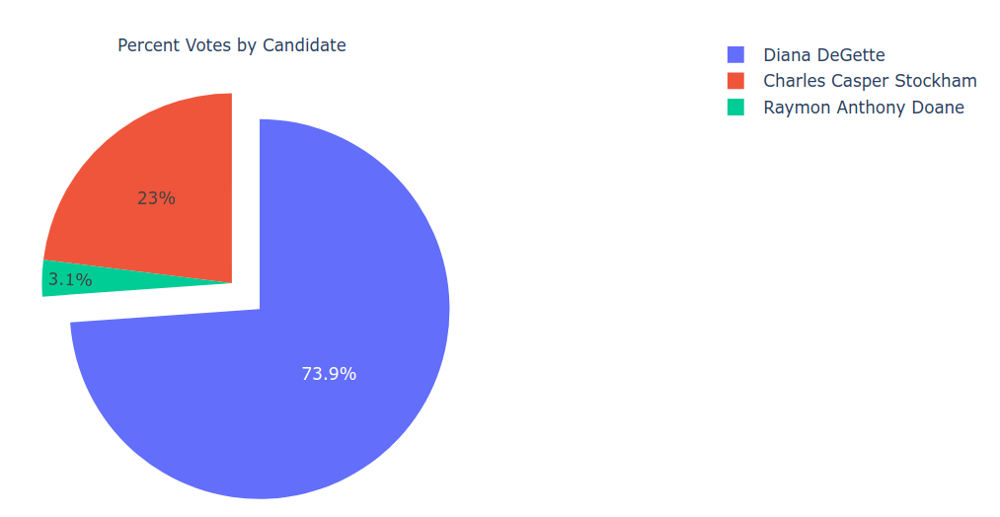
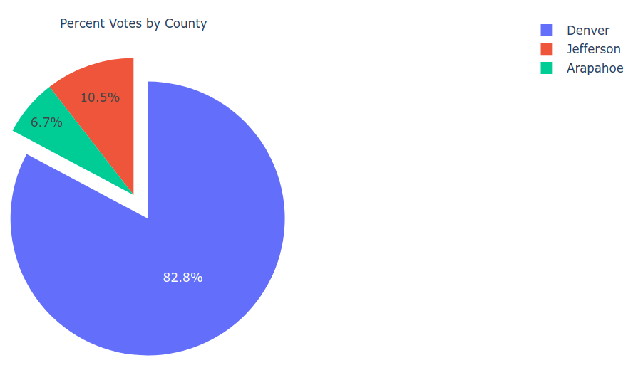

# Election_Analysis

## Project Overview

A Colorado Board of Elections employee has given you the following tasks to complete the election audit of a recent local congressional election.

1. Calculate the total number of votes cast.
2. Get a complete list of candidates who received votes.
3. Calculate the total number of votes each candidate received.
4. Calculate the percentage of votes each candidate won.
5. Determine the winner of the election based on popular vote.

## Resources

- Data Source: [Resources/election_results.csv](election_results.csv)
- Software: Python 3.8.2, Visual Studio Code, 1.44.2

## Summary

The analysis of the election showed the following:

- There were 369,711 votes cast in the election.
- The candidates were the following:
  - Charles Casper Stockham
  - Diana DeGette
  - Raymon Anthony Doane
- The candidate results were the following:
  - Charles Casper Stockham won 23.0% of the vote and 85,213 votes.
  - Diana DeGette won 73.8% of the vote and 272,892 votes.
  - Raymon Anthony Doane won 3.1% of the vote and 11,606 votes.
- The winner of the election was the following:
  - Diana DeGette won 73.8% of the vote and 272,892 votes.

## Challenge Overview

The Colorado Board of Elections employee wants you to extend the election audit of the recent local congressional election to get voter turnout numbers by county.

1. Get a complete list of counties
2. Calculate the total number of votes that were cast in each county
3. Calculate the percentage of votes that were cast in each county.
4. Determine the county with the largest voter turnout.

## Challenge Summary

The analysis of the election results shows the following:

- The counties in which votes were cast are the following:
  - Jefferson
  - Denver
  - Arapahoe
- The county vote tallies are the following:
  - In Jefferson county, 10.5% of the vote and 38,855 votes were cast.
  - In Denver county, 82.8% of the vote and 306,055 votes were cast.
  - In Arapahoe county, 6.7% of the vote and 24,801 votes were cast.
- The county with the largest voter turnout was the following:
  - In Denver county, 82.8% of the vote and 306,055 votes were cast.
